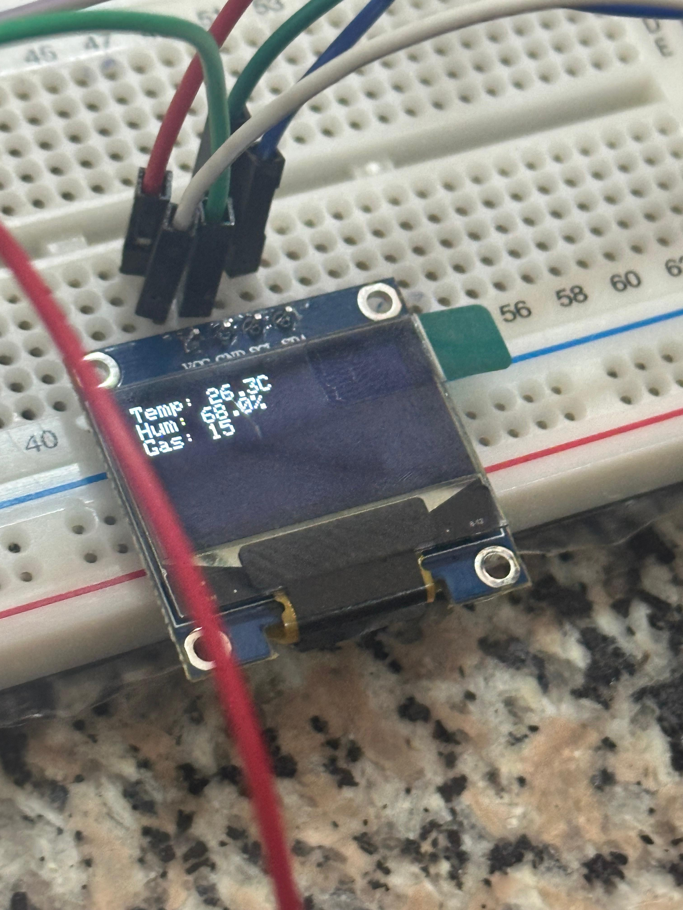
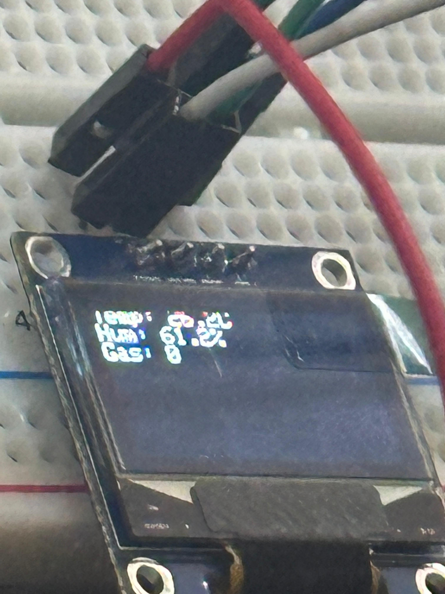
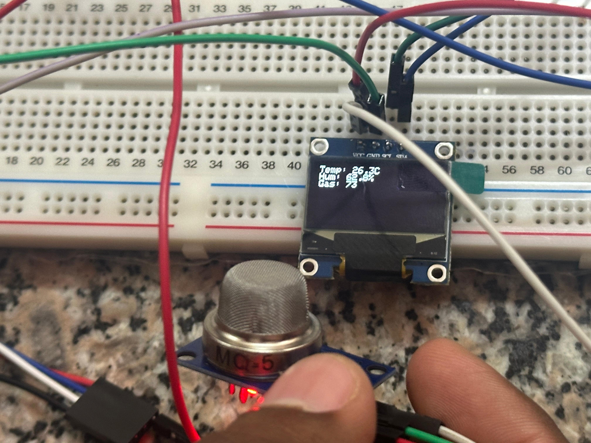
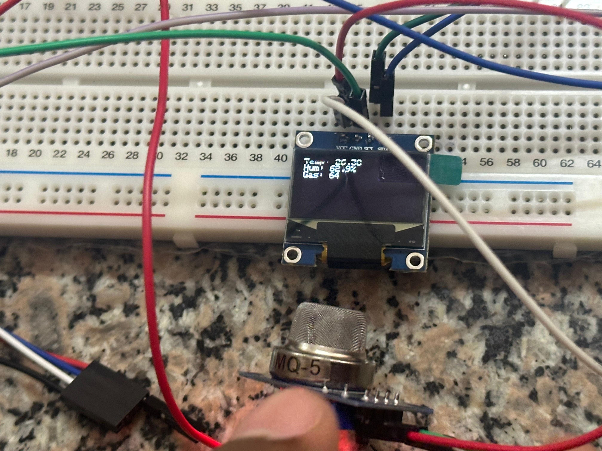
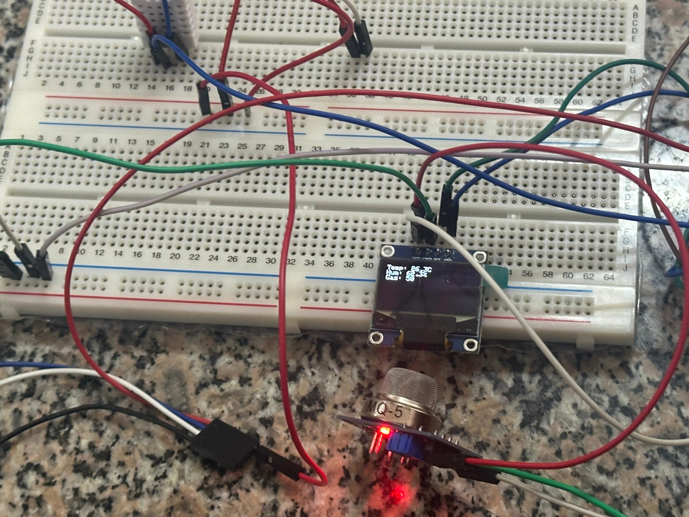
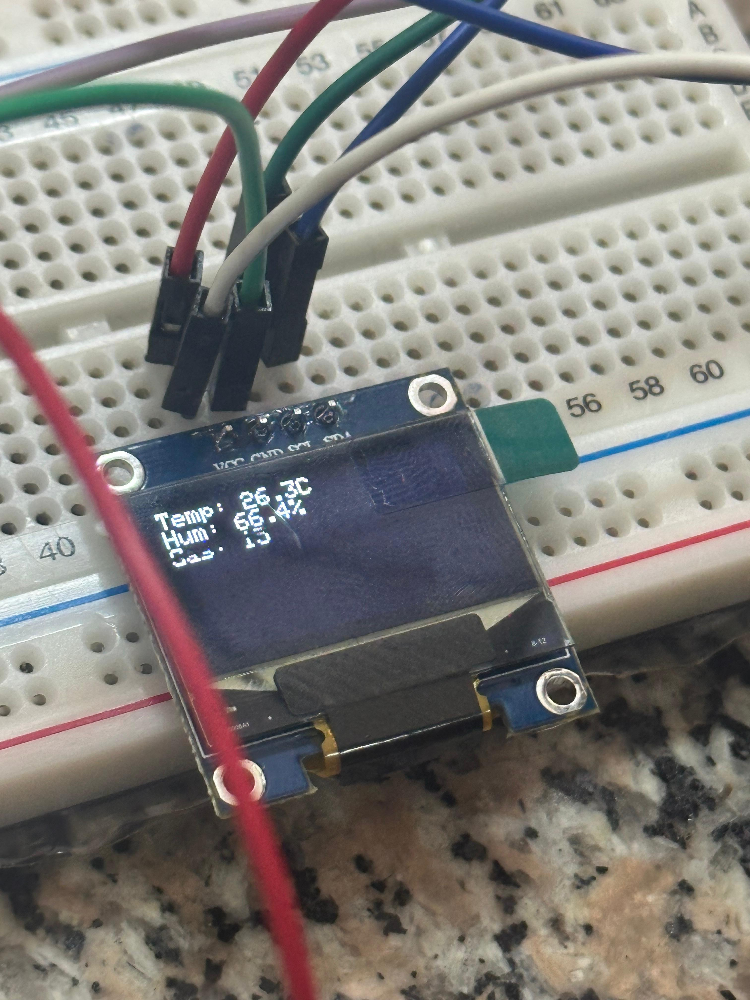

# ICS 4111: Embedded Systems & IoT
## Semester Project – Deliverable 2: Prototyping
*Group 5 — Lazy Lobsters*

---

## 1. Objective

For this deliverable we took the circuit designs from Deliverable 1 and built working prototypes — both physical breadboard builds and Wokwi simulations. The three architectures we had to cover were:

- **Architecture A** – one ESP32S reading the MQ-5, DHT22 and OLED all on one board.
- **Architecture B** – two ESP32S boards connected directly over UART, one handling gas and the other temperature and humidity.
- **Architecture C** – same two-board setup but with a relay in between instead of a direct wire.

B and C are close enough in hardware that we did one physically and simulated the other on Wokwi, which covered both approaches.

---

## 2. Prototype Summary

| # | Architecture | Type | Status | Link / Evidence |
|---|---|---|---|---|
| 1 | A – ESP32 + MQ-5 + DHT22 + OLED | Physical | Working | See section 3 |
| 2 | A – ESP32 + MQ-5 + DHT22 + OLED | Simulated (Wokwi) | Working | https://wokwi.com/projects/467006558712168449 |
| 3 | C – ESP32 (DHT22) → Relay → ESP32 (MQ-5) | Physical | See section 5 | See section 5 |
| 4 | B – ESP32 (MQ-5) ↔ ESP32 (DHT22) | Simulated (Wokwi) | Working | https://wokwi.com/projects/467017703807057921 |

---

## 3. Prototype 1: Physical – Architecture A

### 3.1 Components

- 1× ESP32S development board
- 1× MQ-5 gas sensor
- 1× DHT22 temperature and humidity sensor
- 1× 0.96" I2C OLED display
- Breadboard, jumper wires, current-limiting resistors on the sensor signal lines

### 3.2 Wiring

OLED on I2C (VCC, GND, SCL, SDA), MQ-5 analog out into an ADC pin, DHT22 data line pulled up to a digital GPIO. We put resistors in line with the sensor signals as the instructions required.

### 3.3 Output

Once it was running, the OLED updated every few seconds showing:
We ran seven trials to check the sensors were actually reacting to the environment. Someone held their hand near the MQ-5 on trials 3 and 4 — you can see the gas reading jump to 73 and 64. It came back down to 15 once they moved away, so the sensor was genuinely picking something up.

| Trial | Temp (°C) | Humidity (%) | Gas reading |
|---|---|---|---|
| 1 | 26.3 | 66.4 | 15 |
| 2 | 26.3 | 67.2 | 0 |
| 3 | 26.3 | 62.8 | 73 |
| 4 | 26.3 | 62.9 | 64 |
| 5 | 26.3 | 63.7 | 60 |
| 6 | 26.3 | 63.1 | 61 |
| 7 | 26.3 | 68.0 | 15 |

### 3.4 Photos

*Full breadboard — OLED reading Temp 26.3°C, Hum 66.4%, Gas 15*

*OLED display close-up*

*MQ-5 triggered by hand — Gas 73*

*MQ-5 triggered again — Gas 64*

*Wide shot of the full build*

*Final OLED reading — Hum 68.0%, Gas 15*

---

## 4. Prototype 2: Wokwi Simulation – Architecture A

We put the same circuit into Wokwi to check the code worked regardless of physical component variation. Project: https://wokwi.com/projects/467006558712168449

- Same pin assignments as the physical build — DHT22 on GPIO 4, gas sensor on GPIO 34, OLED on I2C at 0x3C.
- Boots with a splash screen then reads all three sensors every 2 seconds and updates the OLED.
- We disconnected the DHT22 in simulation to test the error path — the OLED correctly switched to a `DHT22 Error!` message instead of showing the last reading.
- Serial output matched what the physical OLED was showing, so we were happy the code was correct.

---

## 5. Prototype 3: Physical – Architecture C (two ESP32s + relay)

### 5.1 Components

- 2× ESP32S boards
- 1× DHT22
- 1× MQ-5 gas sensor
- 1× relay module
- Breadboard, jumper wires, one resistor on the sensor signal line

### 5.2 How it works

Node 2 reads the DHT22 on GPIO 4 and drives the relay from GPIO 12 — relay closes if temperature goes above 28°C. Node 1 reads the MQ-5 on GPIO 36 and watches the relay contacts on GPIO 14 with `INPUT_PULLUP`, so it normally sits HIGH and drops LOW when Node 2 triggers. Node 1 prints the gas level plus a TRIGGERED or NORMAL flag to serial.

Both boards run the same sketch. Each one checks its own MAC address at boot to decide which role to take — even MAC is the gas node, odd MAC is the climate node.

### 5.3 Issues we ran into

- **Jumper wires kept coming loose** between the two boards whenever we moved anything, which gave us intermittent readings. We pushed all the wires directly into the breadboard rows and shortened the runs — that mostly fixed it.
- **The relay drew more current than expected**, which caused voltage dips that made the MQ-5 readings unstable. Moving the relay to its own section of the power rail sorted it out.
- **Going forward** we would solder the connection between the two boards instead of relying on jumper wires. The two-board setup is a lot more fragile to handle than Architecture A.

### 5.4 Photos

*Both ESP32 boards, DHT22, MQ-5 and relay wired together*

*Close-up of the relay module and dual-board wiring*

*Team member connecting the wires between the two boards*

*Team member watching serial monitor output during testing*

---

## 6. Prototype 4: Wokwi Simulation – Architecture B

Since we built Architecture C physically, we used Architecture B as the Wokwi pair. Project: https://wokwi.com/projects/467017703807057921

- The two boards talk over UART2 (GPIO 16 and 17). Node 1 sends gas readings as text, Node 2 listens while also reading its local DHT22 on GPIO 4.
- Role assignment is the same runtime check as the physical build — DHT22 responding means climate node, no response means gas node. Same sketch on both boards.
- Node 2's serial output showed its own temperature and humidity plus the incoming gas value from Node 1, which confirmed the link was working.

---

## 7. Groupwork

- The physical builds were done together, people took turns wiring, holding things in place and reading the outputs.
- The photos in sections 3 and 5 were taken during the actual build sessions.
- Both Wokwi projects are public so everyone in the group could open and run them.

---

## 8. Conclusion

We got working prototypes for all three architectures. Architecture A was straightforward and the simulation matched the physical readings well. Architecture C was harderthe two-board wiring caused real problems that a simulation would not have caught, which is why section 5.3 is longer. The Wokwi simulation for Architecture B covered the approach we didn't build physically and gave us enough confidence it would work in hardware too.
